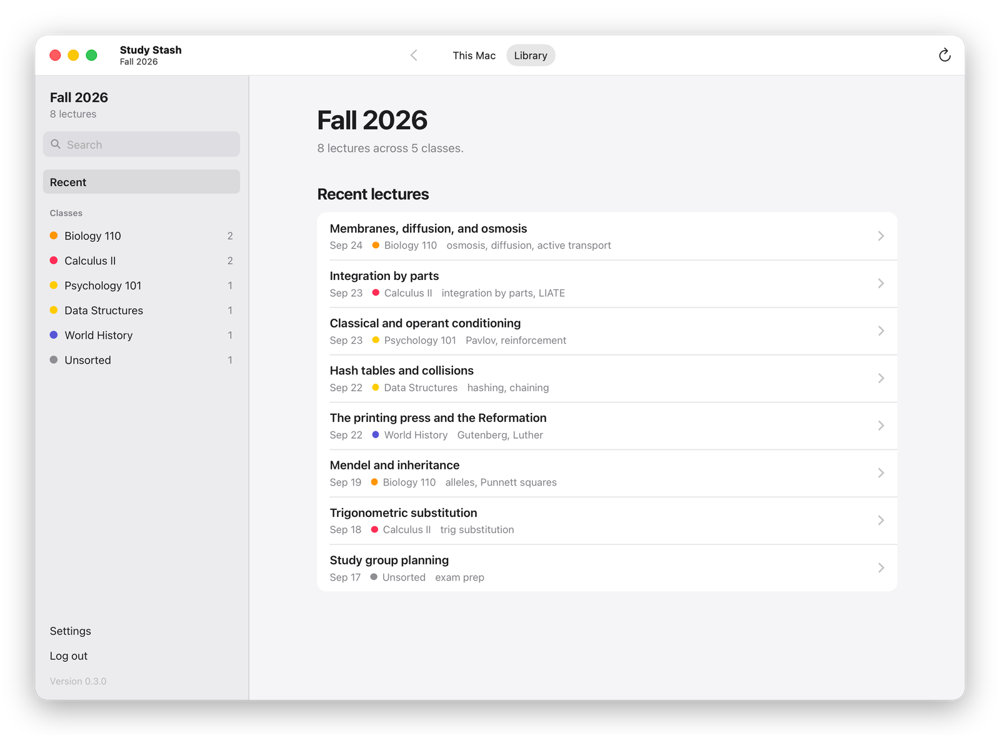
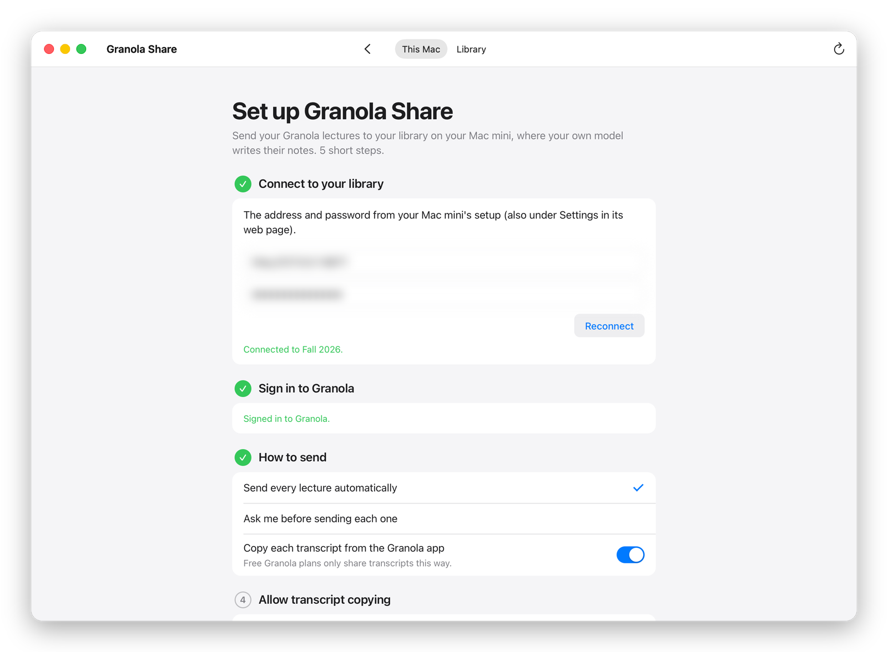
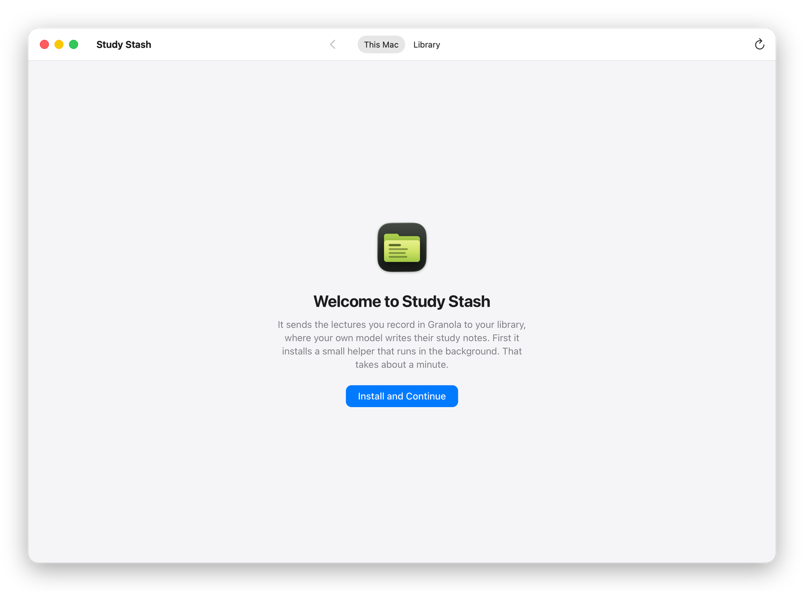
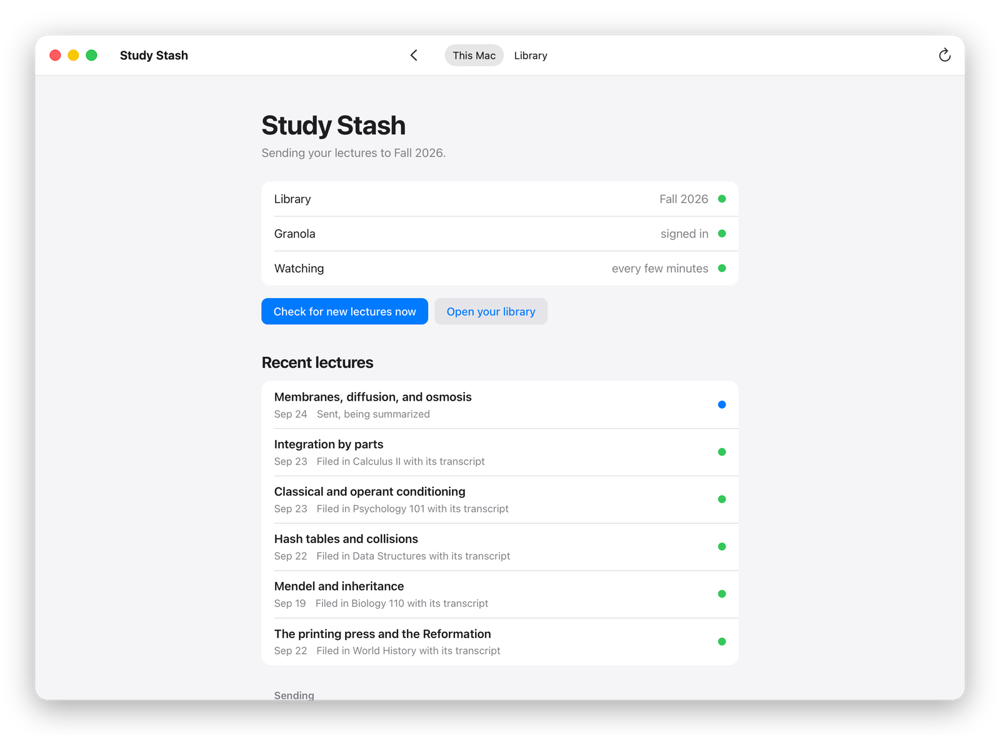
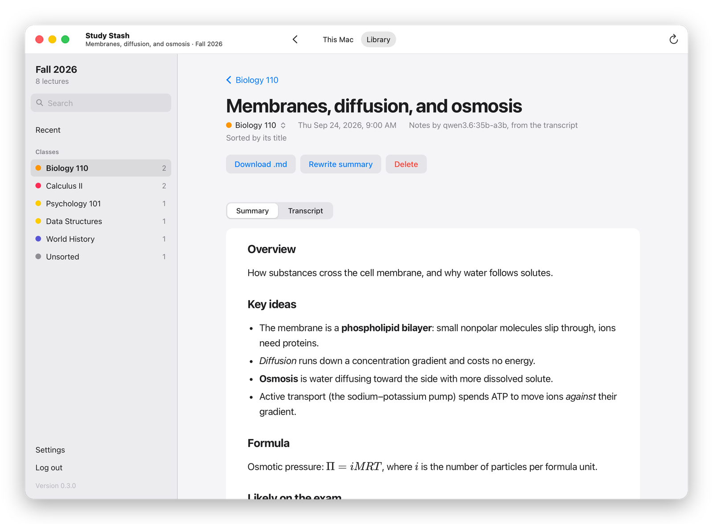
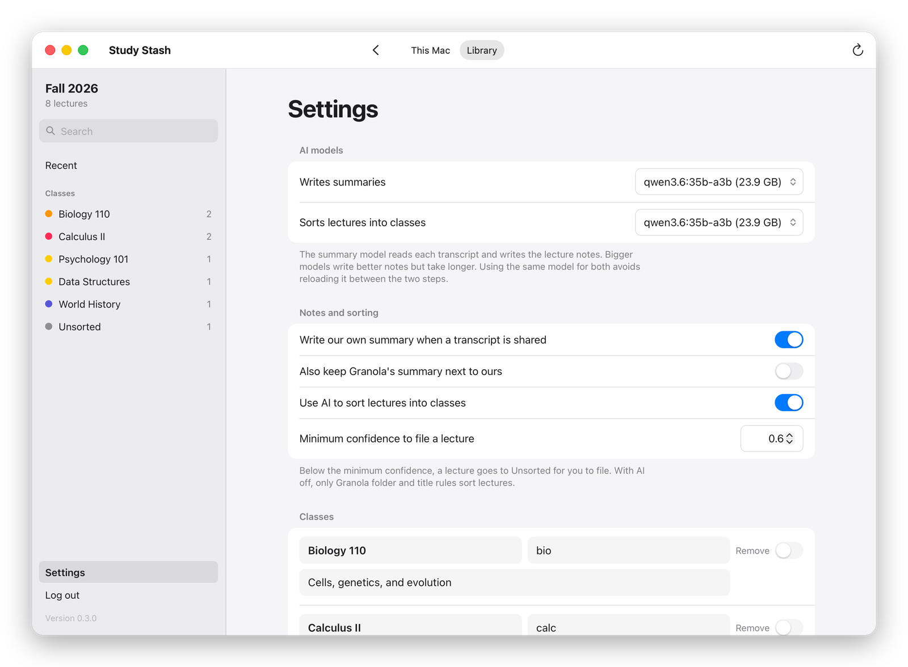

# Study Stash

Your Granola lectures, rewritten into study notes by your own model and sorted by class, on
your own Mac mini or Windows PC (any computer that stays on). Free and open source.

> Study Stash is an independent project, **not affiliated with or endorsed by Granola**.
> "Granola" is a trademark of its owner, and is used here only to say what this works with.

- **Your laptop** records lectures in Granola, as usual. When Granola finishes a lecture, a
  small background app sends it to your library.
- **Your Mac mini** (or a Windows PC that stays on) keeps the library. It writes study notes from each lecture's transcript
  with the Ollama model you pick, files each lecture under its class, and serves a web page
  you can open from your laptop or phone over Tailscale.

It uses Granola's official MCP connector (free) and a local Ollama model, so nothing is paid.
The command it installs is still called `granola-share`, from before it was renamed.

<p align="center"></p>

```
your laptop                                        your Mac mini
┌──────────────────────────┐   POST /api/ingest   ┌────────────────────────────────────┐
│ Granola records          │ ───────────────────▶ │ queue → study notes from the       │
│ Study Stash (bg app)   │   over Tailscale     │   transcript (your Ollama model)   │
│  ↳ finished lectures     │                      │ → sort into a class                │
│  ↳ copies the transcript │ ◀─────────────────── │ ~/GranolaShare/<Class>/*.md        │
└──────────────────────────┘  browse, search, zip │ web page  http://<mini>:8787       │
                                                  └────────────────────────────────────┘
```

## 1. Set up the library's computer

On the Mac mini (or any Mac or Linux computer that stays on), in Terminal:

```bash
curl -fsSL https://raw.githubusercontent.com/Joseph-Rus/study-stash/main/install.sh | sh -s -- server
```

On a Windows PC, in PowerShell:

```powershell
$env:GRANOLA_SHARE_ROLE='server'; irm https://raw.githubusercontent.com/Joseph-Rus/study-stash/main/install.ps1 | iex
```

The installer puts a `granola-share` command on that computer. It uses uv, so it needs no admin
rights, git, or Python install, and it keeps its own Python, so a system upgrade can't break it.
Setup then walks through six steps:

1. **Get this computer ready:** shows the memory and free disk space, then checks
   [Tailscale](https://tailscale.com) (so your laptop and phone reach the library from anywhere)
   and [Ollama](https://ollama.com) (which runs the model that writes your notes). If one is
   missing, setup offers to install it from its official site. If it's closed or signed out,
   setup starts it or connects it. Tailscale's installer asks for your password (Mac) or
   permission (Windows), and you sign in to Tailscale in your browser. Over SSH, setup tells you
   what to click on the Mac itself instead.
2. **Your library:** a name, a password (your laptop and browser use it), the notes folder, and
   the web port. It checks that the folder is writable and the port is free.
3. **Classes:** the folders lectures are sorted into, plus any short names you use in Granola
   folder names or titles.
4. **Study notes:** lists your Ollama models and asks which model writes the study notes and
   which sorts. It downloads a missing model with a progress bar, then has the model answer once,
   so you know it works before the first lecture arrives.
5. **Keep it running:** starts at login, restarts if it stops, and installs updates by itself. It
   checks that the library actually answers. On Windows it also lets your laptop through Windows
   Firewall (for Tailscale and your own network only; Windows asks first) and offers to keep the PC
   awake while it's plugged in. On a Mac it tells you if the Mac will sleep.
6. **Connect your laptop:** prints the address, the password, and a one-line install for your
   laptop with both filled in.

Rerunning setup is safe: your earlier answers become the defaults. `granola-share doctor`
checks the whole setup at any time, and says what to fix.

**Or with the Library app.** Download [Study-Stash-Library.dmg](https://github.com/Joseph-Rus/study-stash/releases/latest/download/Study-Stash-Library.dmg)
(Mac) or [Study-Stash-Library-Setup.exe](https://github.com/Joseph-Rus/study-stash/releases/latest/download/Study-Stash-Library-Setup.exe) (Windows) and
open **Study Stash Library**. Click **Set Up**: the same six steps run in a Terminal or
PowerShell window, and when they're done, the app shows your library. After that it's this
computer's window onto the library.

**Requirements:** Tailscale on both computers, signed in to the same account, so the laptop
reaches the library away from home. Without it, the laptop reaches the library only on the same
Wi-Fi. Ollama is needed for study notes and AI sorting. Without it, Granola folder and title
rules still sort lectures. Setup installs both for you if you say yes. The library goes offline
while its computer sleeps: on a Mac, turn on System Settings → Energy → "Prevent automatic
sleeping when the display is off".

**Which model?** Setup suggests one that fits your RAM. With 40 GB or more, use
`qwen3.6:35b-a3b`: it's a mixture-of-experts model with 35B-class judgment but only about 3B
active per token, so it's fast. With 16 GB, use `gemma4:e4b`; with 8 GB, `qwen3:1.7b`. Using
the same model for both jobs avoids reloading it between the two steps.

## 2. Connect your laptop

This is the computer you record lectures on, a Mac or a Windows PC. It needs
[Granola](https://www.granola.ai/download), since that's what records the lectures. (The library's
computer doesn't need Granola.) Paste the line from the library's setup (it's also under
**Settings → Connect your laptop** on the library's web page):

```bash
# Mac / Linux (Terminal)
curl -fsSL https://raw.githubusercontent.com/Joseph-Rus/study-stash/main/install.sh | GRANOLA_SHARE_SERVER=http://mac-mini.tailnet.ts.net:8787 GRANOLA_SHARE_KEY=the-password sh
```
```powershell
# Windows (PowerShell)
$env:GRANOLA_SHARE_SERVER='http://mac-mini.tailnet.ts.net:8787'; $env:GRANOLA_SHARE_KEY='the-password'; irm https://raw.githubusercontent.com/Joseph-Rus/study-stash/main/install.ps1 | iex
```

That's the last time you touch the terminal on the laptop. The line installs granola-share,
starts it in the background, adds the **Study Stash** app (in Applications on a Mac, in the Start
Menu on Windows), and opens it on setup with the address and password filled in.

At the top, **This computer** checks for Granola and Tailscale. If Granola is missing, **Get
Granola** opens its download page. If Tailscale is missing, **Install Tailscale** downloads its
installer and opens it; if it's signed out, **Open Tailscale** opens it to sign in. Then:

1. **Connect to your library.** One click checks the address and password.
2. **Sign in to Granola.** A browser tab opens for your Granola account.
3. **How to send.** Every lecture automatically, or ask before each one. On a Mac there's also the
   [optional transcript copying](#optional-copy-transcripts-from-the-granola-app), off unless you
   turn it on.
4. **Allow transcript copying** (only if you turned it on). A button opens the right page of System
   Settings, where you turn on **python3.12**. The step turns green as soon as it's on. If
   python3.12 isn't in the list, the page shows its exact path with a Copy button.
5. **Finish.**

<p align="center"></p>

Each step turns into a green check when it's done. (`granola-share client setup` still works in
the terminal if you prefer it.)

### Or: download the app

Every release has four installers, on the
[releases page](https://github.com/Joseph-Rus/study-stash/releases/latest): one for each
computer, on each system.

| | The laptop you record on | The computer that keeps your library |
|---|---|---|
| **Mac** | [Study-Stash-Laptop.dmg](https://github.com/Joseph-Rus/study-stash/releases/latest/download/Study-Stash-Laptop.dmg) | [Study-Stash-Library.dmg](https://github.com/Joseph-Rus/study-stash/releases/latest/download/Study-Stash-Library.dmg) |
| **Windows** | [Study-Stash-Laptop-Setup.exe](https://github.com/Joseph-Rus/study-stash/releases/latest/download/Study-Stash-Laptop-Setup.exe) | [Study-Stash-Library-Setup.exe](https://github.com/Joseph-Rus/study-stash/releases/latest/download/Study-Stash-Library-Setup.exe) |

The laptop's app installs its background helper with one click the first time you open it, then
shows the same setup. The library's app runs the library's setup (see above). The install lines
skip the security questions below, because they fetch the app themselves.

- **Mac:** open the DMG and drag the app into Applications. macOS asks once before opening an
  app from the internet that isn't from the App Store: click **Done**, then **System Settings →
  Privacy & Security → Open Anyway**.
- **Windows:** run the Setup.exe. It installs for your account only, with no admin rights, and
  adds the app to the Start Menu. The app isn't signed, so Windows may say "Windows protected your
  PC": click **More info**, then **Run anyway**.

<p align="center"></p>

## 3. Using the app

Open **Study Stash** from Applications or Spotlight. Its toolbar has two tabs:

- **This Mac** (⌘1): whether everything is working, what was sent and where each lecture was
  filed, and how this laptop sends. If something needs you, like a new password on the Mac mini
  or signing in to Granola again, it shows here in red with the fix next to it.
- **Library** (⌘2): your library on the Mac mini, signed in with the password this Mac already has.

<p align="center"></p>

⌘R reloads, ⌘+ and ⌘− zoom, and downloads land in Downloads. It follows your Mac's light or
dark mode. On the Mac mini the app shows just the library.

**On Windows** it's the same app: open **Study Stash** from the Start Menu. Its tabs are **This
PC** (Ctrl+1) and **Library** (Ctrl+2), F5 reloads, Ctrl+plus and Ctrl+minus zoom, and it follows
Windows' light or dark mode. It's built on WebView2, the Edge engine that comes with Windows 10
and 11. (On Linux, Study Stash opens in its own Chrome or Edge window instead.)

## When a lecture finishes

There's nothing to learn. Record in Granola, stop, and carry on. When Granola has finished the
note, Study Stash sends it to your library (or asks first, if you chose "ask before each one").
When the library has filed it, you get one notification: *"… is in Fall 2026 under Bio 110."*

With [transcript copying](#optional-copy-transcripts-from-the-granola-app) turned on:

- **You stopped the recording in Granola** (the usual case): a few seconds later, the transcript
  panel opens, the transcript is copied, and the panel closes again. You don't click anything.
- **Granola wasn't in front** (you stopped it from the menu bar, or it stopped by itself): one popup
  asks *"Save it to Fall 2026 with its transcript?"*
  - **Save** brings Granola forward, copies the transcript, and puts you back where you were.
  - **Not now** sends the lecture with Granola's own summary instead.
- **A lecture went out without its transcript:** open it in Granola later. The transcript is picked
  up and the notes are rewritten.

## Study notes from the transcript

Granola's own summary comes from whatever model Granola runs. When a lecture arrives with its
transcript, the library writes its own study notes from it instead, with your model: an
overview, key concepts, worked examples and formulas, announcements with their dates, and review
questions. Long transcripts are summarized in parts, then merged. It all happens in the
background, one lecture at a time, so sending never waits on the model.

Transcripts come through Granola's official connector on Granola's paid plans. Without a
transcript, a lecture keeps Granola's own summary.

### Optional: copy transcripts from the Granola app

On a Mac, Study Stash can press Granola's own **Copy transcript** button for you when a lecture
ends, so your notes are written from the transcript. **It's off unless you turn it on**, in the
app under **Sending**. Before you do, know that:

- **It automates the Granola app.** Granola's terms of service forbid scraping content from
  their service "through use of manual or automated means", and this may count. Using it could
  put your Granola account at risk. It's your call, for your own account.
- **What it does:** it notices a recording ending when Granola stops using the microphone. Then
  it opens the transcript panel if needed and clicks **Copy transcript**, only in a pause in your
  typing, and puts your clipboard, cursor, and selection back right after. Nothing else is read
  from Granola.
- **It needs** Accessibility permission for **python3.12**. The app's Allow step opens the right
  page of System Settings.

Pick the model, turn our study notes off, or keep Granola's summary next to them under
**Settings** on the library's web page. After switching models, **Rewrite all summaries** redoes
the library one lecture at a time. Each lecture stays readable while it waits.

## The library

It's the app's Library tab, and also a web page at `http://<mac mini>:8787` for your phone or any
browser, behind your password. On the Mac mini itself, it opens without one.

- Each class has a color dot that follows it everywhere it appears.
- Search covers titles, summaries, topics, and transcripts.
- Each lecture has Summary, Transcript, and Typed notes, and formulas render as math. Its class
  is a menu under the title: pick another and the lecture moves. You can also rewrite its
  summary, delete it, or download it as Markdown.
- Download a whole class as a zip.

<p align="center"></p>

**Settings** has the models, what gets written and how lectures are sorted, your classes, the
install line for a laptop, updates, and rewriting every summary:

<p align="center"></p>

<sub>Screenshots use made-up lectures; addresses and passwords are blurred.</sub>

## Updates

Both computers update themselves: the background service checks GitHub for a new release every
few hours, installs it, and restarts. Turn this off with `auto_update = false` in the config.
To update right away, run `granola-share update`, or click **Update now** in Settings.

Releases come from CI (`.github/workflows/ci.yml`). Every push runs the tests on macOS, Linux,
and Windows, runs the real one-line installer on each (twice, to check that updating in place
works), then sets up and boots a library and a laptop page without a keyboard. To ship a
release, bump `__version__` in `granola_share/__init__.py` and push to `main`. When everything
passes, CI publishes `v<version>`, and both computers pick it up. To roll back, rerun the
installer with `GRANOLA_SHARE_VERSION=v0.2.0` (or whichever version you want).

## Set up with Claude Code

Open this repo in Claude Code and say "set me up". The `granola-share-setup` agent
(`.claude/agents/granola-share-setup.md`) works out whether it's on the Mac mini or the laptop,
asks for your answers, runs the install and setup, then runs `granola-share doctor` and fixes
what it finds. To have it in every project, copy the file to `~/.claude/agents/`.

## Troubleshooting

Start with `granola-share doctor`. It checks every piece and prints a fix for each problem.

| Problem | Fix |
|---|---|
| The installer failed | Read `~/.granola-share/install.log`, then rerun the same line. It's safe to repeat. |
| `granola-share: command not found` | Open a new terminal window, or use `~/.local/bin/granola-share`. |
| Laptop: "could not reach …" | Tailscale on and signed in on both computers, and the library's computer awake. Try the `100.x.y.z` address instead of the name. |
| "Granola app ✗ not installed" | Install Granola from [granola.ai/download](https://www.granola.ai/download). Only the laptop needs it, not the library's computer. |
| Windows install: "untrusted mount point (os error 448)" | OneDrive's Files On-Demand blocked uv. Fixed in 0.4.1: the installer keeps uv's Python and tools in `AppData\Local`. Run the install line again. |
| Windows: "Windows protected your PC" | The app isn't signed. Click **More info**, then **Run anyway**. The install line avoids the question. |
| Windows: Study Stash asks for WebView2 | Older Windows 10 may not have it. Say yes, and install it from Microsoft. |
| Laptop can't reach a library on Windows | Windows Firewall. Rerun `granola-share setup` on the PC and let it add the rule (Windows asks for permission). |
| Tailscale "signed out" or "turned off" | Open Tailscale and sign in with the same account on both computers, or rerun `granola-share setup` to connect it. |
| Laptop: "wrong password" | The password is in the Mac mini's `~/.granola-share/config.toml`, and under Settings on the library's page. |
| No study notes, only Granola's | The transcript wasn't copied (open the lecture's transcript in Granola), or Ollama is closed on the Mac mini. |
| A lecture shows "Failed" | Open it, then **Try again**. The reason is on the page and in `~/.granola-share/logs/server.log`. |
| Sign-in timed out | Open Study Stash and click **Sign in to Granola again**. |
| "Copy transcripts ✗ Accessibility" | Open Study Stash and click **Allow transcript copying**, then turn on **python3.12**. |
| Transcripts aren't copied | They're copied only while Granola is in front with the lecture's transcript panel open. Open it and wait a few seconds. |

Logs live in `~/.granola-share/logs/` (`server.log`, `client.log`, `update.log`).

## Commands

| Command | What it does |
|---|---|
| `setup` | set up the library (safe to rerun; `--help` lists flags to answer without prompts) |
| `run` | the library: web page, ingest API, study notes (+ its own sync if enabled) |
| `client open [--install] [--no-browser]` | show Study Stash (the app on a Mac, its own window on Windows), starting its service if needed |
| `client setup` | laptop setup in the terminal instead (`--server`, `--key`, `--mode`, `--yes`, …) |
| `client run [--no-ui]` / `client once [--auto]` | the laptop's background service, or check once |
| `client login` / `login` | sign in to Granola again |
| `doctor` | check this computer's setup and print fixes |
| `update [--check]` | install the newest release and restart the background service |
| `autostart install\|uninstall\|status --role server\|client` | background service: launchd, the Windows Startup folder (with a keep-alive loop and log), or systemd --user |
| `tools --probe` | print Granola's MCP tools and your latest notes (debugging) |

Everything lives in `~/.granola-share` (override with `--home` or `GRANOLA_SHARE_HOME`):
`config.toml` (Mac mini) or `client.toml` (laptop), `tokens.json` (0600), `state.db`,
`client_state.json`, `transcripts/`, `logs/`, `debug/last_meetings.json`. Back up the Mac
mini's `~/.granola-share` and `~/GranolaShare` (Time Machine is enough).

## How sorting works

1. **Folder / title rules.** If the lecture's Granola folder or title matches a class name or
   alias, that class wins, and the model still writes a proper lecture title and topic tags.
2. **Ollama.** Otherwise the model reads the study notes (or Granola's summary, without a
   transcript) and picks a class with a strict JSON schema. Below `min_confidence`, the lecture
   goes to Unsorted.
3. **You.** Move a lecture from its page. Rewriting a summary never undoes that.

## Why this design

Granola's official connectors are read-only, so nothing can move a note into a Granola folder
for you. Instead the laptop pushes finished lectures to your library. Granola's public API
(used by the Obsidian plugins and granola-exporter) needs the paid Business plan; the MCP
connector is free. Details and alternatives are in [docs/DESIGN.md](docs/DESIGN.md).

## Legal and privacy

- **Not affiliated with Granola.** Study Stash is an independent, unofficial project. It isn't made,
  endorsed, or supported by Granola, and "Granola" is their trademark. It gets your notes through
  Granola's official MCP connector, signed in as you. Its one optional feature that automates the
  Granola app is off unless you turn it on ([why](#optional-copy-transcripts-from-the-granola-app)).
- **Recording is your responsibility.** Before recording a lecture, class, or conversation, make
  sure you're allowed to. Recording laws differ, and some places require everyone's consent.
  Schools often have their own rules about recording lectures and sharing notes. Study Stash is for
  your own study notes, not for redistributing lecture content.
- **Your data stays with you.**
  - Lectures, transcripts, and study notes live on your own computers.
  - Study notes are written by a model running on your own computer.
  - Nothing is sent to this project or its author, and there's no analytics.
  - The only outside services are Granola (your own account, over its official connector) and
    GitHub (update checks and downloads).
- **No warranty.** It's provided as is, under the [MIT License](LICENSE). Check your notes against
  the lecture before relying on them, since models make mistakes.
- **Security:** see [SECURITY.md](SECURITY.md) to report a problem.

## Development

```
granola_share/
  config.py     library + laptop TOML config (reader and writer)
  wizard.py     the two terminal setups (every question answerable by a flag)
  ready.py      get the library's computer ready: install/connect Tailscale and Ollama, Windows
                firewall and sleep
  doctor.py     `granola-share doctor` health checks
  oauth.py      discovery, dynamic client registration, PKCE login, refresh
  granola.py    MCP client; discovers tool argument names at runtime
  client.py     laptop watcher: poll → popup → send → "it's filed"
  client_app.py the laptop's Study Stash page: setup and status, on 127.0.0.1 only
  launcher.py   the Study Stash app (native on macOS, else a script), Start Menu, .desktop
  assets/       the icon for Windows, Linux, and the pages (from macos/icon_assets.py)
windows/        the Windows app: StudyStash.cs (WebView2), build.ps1 → zip, setup.iss → Setup.exe
macos/          the native Mac app: StudyStash.swift, its icon, build.sh → .app, zip, DMG; tour.py
                → docs/screenshots
  transcript_grab.py  macOS, optional: copy transcripts from the Granola window
  dialogs.py    native popups and notifications (macOS/Windows/Linux)
  autostart.py  launchd / Startup folder / systemd --user
  update.py     release check, uv upgrade, auto-update loop
  store.py      SQLite index, processing queue, Markdown writer
  pipeline.py   background worker: summarize → sort → save
  summarize.py  study notes from a transcript (chunked for long lectures)
  classify.py   rules → Ollama structured output → Unsorted
  ollama.py     find / start / pull (with progress) / try / recommend models
  hostinfo.py   Tailscale address, the laptop install line, port checks
  sync.py       the library's own Granola poll loop (optional)
  web.py, ui.py FastAPI app and its HTML
  cli.py        the granola-share command
tests/          offline tests: .venv/bin/python -m pytest
```

Build the Mac app with `sh macos/build.sh` (Xcode command line tools; the output lands in `dist/`),
and the Windows app with `windows\build.ps1` (the .NET SDK, plus Inno Setup for Setup.exe). The
Windows app also compiles on a Mac with the .NET SDK, which is a quick check before CI.
Redo the README's screenshots with `uv run --with pillow python macos/tour.py` after a build. It
serves made-up lectures, lets the app capture its own window, and blurs addresses and passwords.
From a checkout: `python3.12 -m venv .venv && .venv/bin/pip install -e ".[dev]"`. To try the
installer against your working copy, run
`GRANOLA_SHARE_SRC=$PWD GRANOLA_SHARE_NO_SETUP=1 sh install.sh`.

## Known unknowns

- The exact field names Granola's MCP tools return can change. The client maps common variants
  and saves the last raw payload under `debug/`; run `granola-share tools --probe` to check.
- Copying transcripts from the Granola app depends on the app's own labels (the "Copy transcript"
  button), so a Granola redesign can break it until granola-share is updated. The Study Stash
  page and `doctor` show when the last copy happened. Accessibility access is granted to the
  python3.12 that granola-share runs on, so other programs using that same Python share it.
- On Windows, CI runs the installer, the tests, the library as a background service (with its
  keep-alive loop and log), and the Start Menu shortcut. It also builds the Windows app, checks
  that it starts and shows its first screen, and installs it with Setup.exe. Installing Ollama and
  Tailscale from setup, the firewall rule, the app's sign-in to the library, and the popups
  haven't been used on a real Windows PC yet.
- Lecture recordings capture other people (your professors, classmates). Check your school's
  recording policy.
